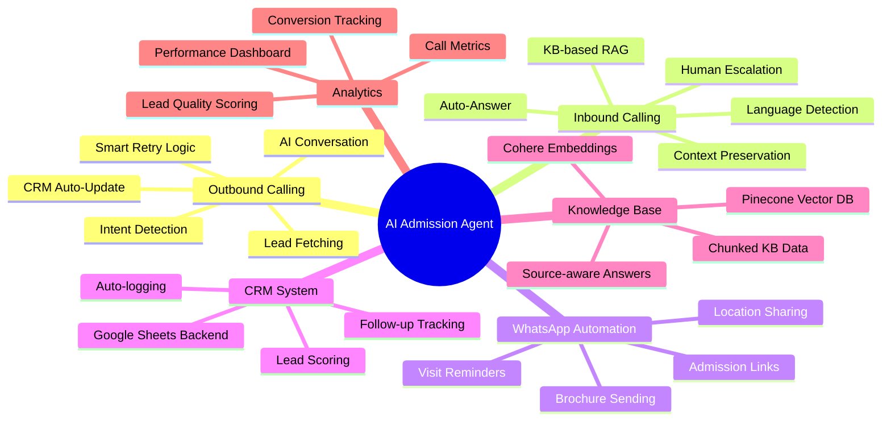
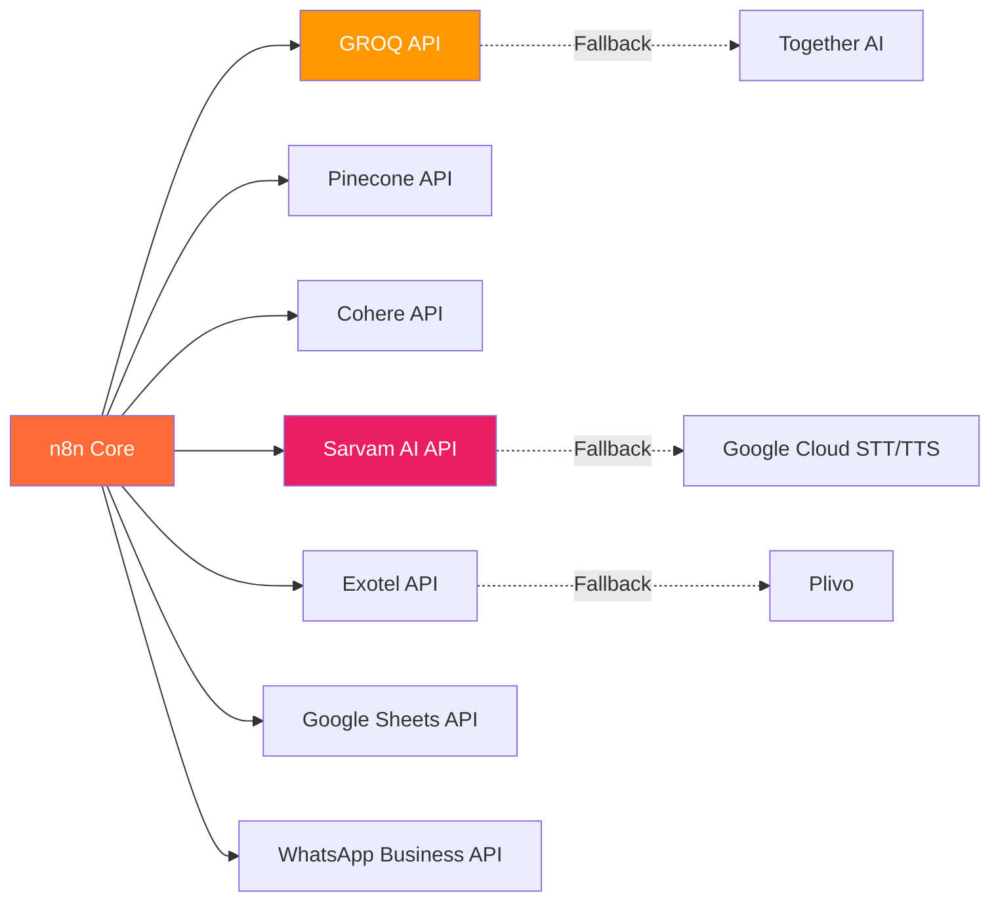
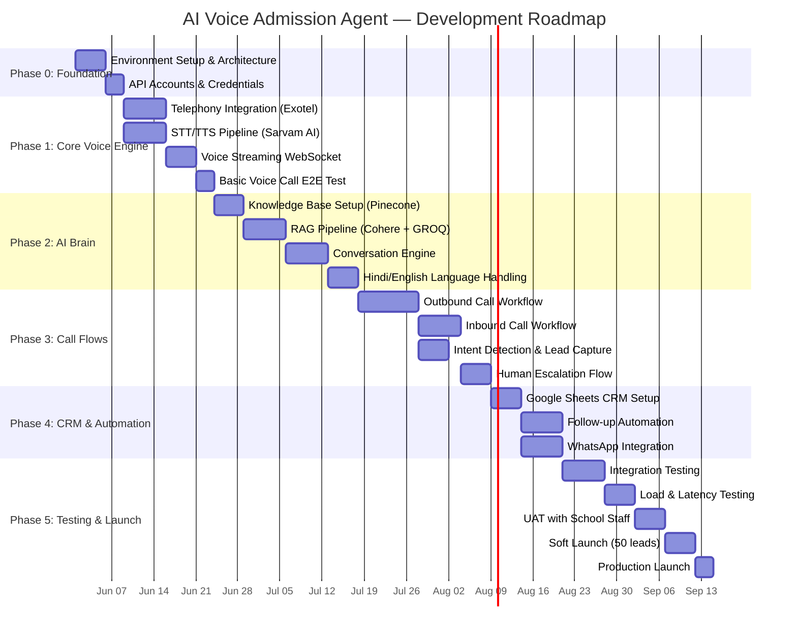
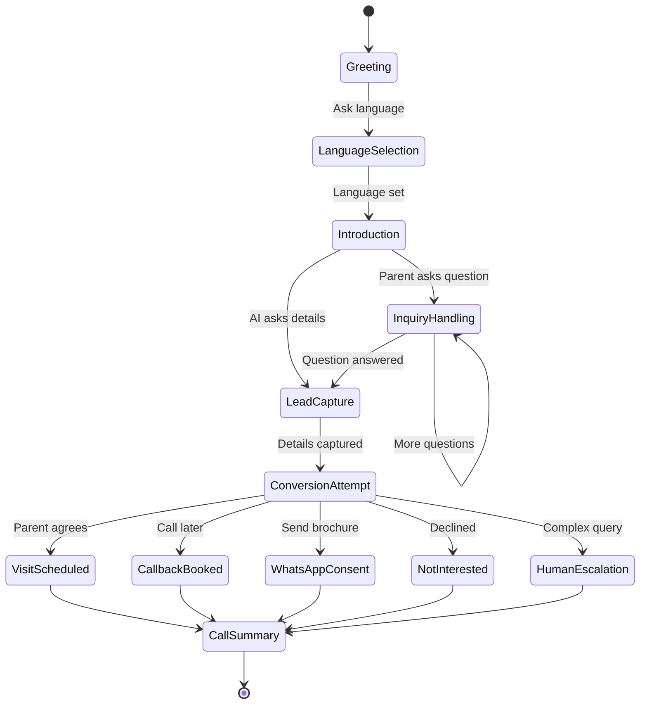
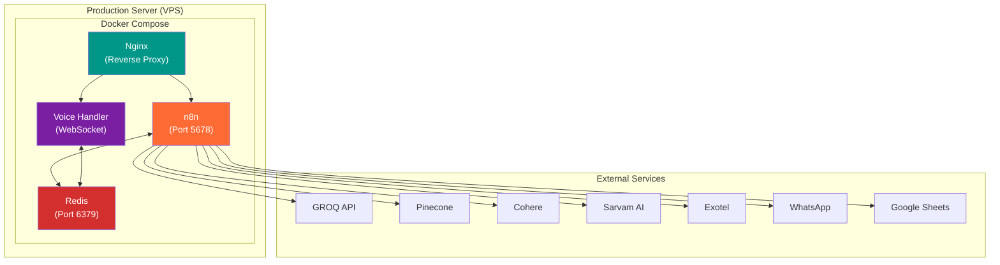

# 🎯 AI Voice Calling Admission Agent — Technical Analysis, Roadmap & Implementation Plan

> **Project:** Modern Academy — AI-Powered Admission Conversion System  
> **Analysis Date:** May 26, 2026  
> **Role:** Technical Project Manager & Digital Product Management Expert  
> **Source:** [job_discriptoin.txt](file:///c:/Users/SkillSeba%20PC-2/Project/Upwork_Jobs_Tracker/Student_Supervise/job_discriptoin.txt)

---

## 📋 Table of Contents

1. [Executive Summary](#1-executive-summary)
2. [Project Scope Analysis](#2-project-scope-analysis)
3. [Technical Architecture Assessment](#3-technical-architecture-assessment)
4. [Risk Analysis & Mitigation](#4-risk-analysis--mitigation)
5. [Tech Stack Evaluation](#5-tech-stack-evaluation)
6. [Phased Roadmap](#6-phased-roadmap)
7. [Sprint-Level Implementation Plan](#7-sprint-level-implementation-plan)
8. [Team Structure & Skill Requirements](#8-team-structure--skill-requirements)
9. [Cost Estimation](#9-cost-estimation)
10. [Deployment & Scaling Strategy](#10-deployment--scaling-strategy)
11. [Quality Assurance Plan](#11-quality-assurance-plan)
12. [Success Metrics & KPIs](#12-success-metrics--kpis)
13. [Student Supervision Checkpoints](#13-student-supervision-checkpoints)

---

## 1. Executive Summary

### 🔍 Project Overview

This is a project to create a **production-grade AI Voice Calling Admission Agent** for an Indian school called **Modern Academy**. The system will handle automated outbound/inbound voice calling, lead nurturing, WhatsApp engagement, and CRM automation using n8n workflow orchestration.

### 🎯 Core Business Objective

| Aspect | Detail |
|--------|--------|
| **Primary Goal** | AI-powered automated admission lead conversion |
| **Target Market** | Indian school admissions (Hindi + English) |
| **Key Metric** | Student admission conversion rate increase |
| **Cost Target** | ₹1.5–₹8 per conversation minute |
| **Latency Target** | Under 1.5–2 seconds response delay |

### ⚠️ Complexity Rating: **HIGH (8.5/10)**

The complexity of this project is high due to:
- Real-time voice streaming + AI integration
- Multi-language support (Hindi + English)
- Multiple third-party API integrations (7+ services)
- Production-grade reliability requirements
- Ultra-low latency constraints
- Concurrent call handling

---

## 2. Project Scope Analysis

### 2.1 Feature Decomposition



### 2.2 Feature Priority Matrix (MoSCoW)

| Priority | Features |
|----------|----------|
| **Must Have** | Outbound calling flow, Inbound call handling, Google Sheets CRM, KB/RAG integration, Hindi+English voice, Basic follow-up automation |
| **Should Have** | WhatsApp automation, Human escalation with context, Analytics dashboard, Smart retry logic |
| **Could Have** | Lead scoring AI, Re-engagement workflows, WhatsApp link click tracking, Advanced analytics |
| **Won't Have (v1)** | Video calling, Multi-school support, Custom CRM migration, Mobile app |

### 2.3 Major System Components (7 Modules)

| # | Module | Complexity | Dependencies |
|---|--------|-----------|--------------|
| 1 | **Voice Engine** (STT/TTS + Telephony) | 🔴 Very High | Sarvam AI, Telephony Provider |
| 2 | **AI Conversation Engine** (LLM + RAG) | 🔴 Very High | GROQ, Pinecone, Cohere |
| 3 | **n8n Orchestration Layer** | 🟡 High | n8n server, Webhooks |
| 4 | **CRM Module** (Google Sheets) | 🟢 Medium | Google Sheets API |
| 5 | **WhatsApp Automation** | 🟡 High | WhatsApp Business API |
| 6 | **Follow-up & Scheduling** | 🟡 High | n8n cron, CRM data |
| 7 | **Analytics & Reporting** | 🟢 Medium | CRM data, Call logs |

---

## 3. Technical Architecture Assessment

### 3.1 Architecture Overview

```mermaid
flowchart TB
    subgraph "Data Layer"
        GS[("Google Sheets\n(CRM)")]
        PC[("Pinecone\n(Vector DB)")]
        LOGS[("Call Logs\n& Transcripts")]
    end

    subgraph "Orchestration Layer (n8n)"
        OB["Outbound Call\nWorkflow"]
        IB["Inbound Call\nWorkflow"]
        FU["Follow-up\nWorkflow"]
        WA["WhatsApp\nWorkflow"]
        CRM["CRM Update\nWorkflow"]
        ESC["Escalation\nWorkflow"]
        KB["KB Retrieval\nWorkflow"]
    end

    subgraph "AI Processing Layer"
        GROQ["GROQ\n(LLM Engine)"]
        COH["Cohere\n(Embeddings)"]
        SAR_STT["Sarvam AI\n(STT)"]
        SAR_TTS["Sarvam AI\n(TTS)"]
    end

    subgraph "Communication Layer"
        TEL["Telephony\n(Exotel/Plivo)"]
        WAAPI["WhatsApp\nBusiness API"]
    end

    subgraph "External"
        PARENT["Parent/Student\n(Caller)"]
        COUNSEL["Human\nCounselor"]
    end

    PARENT -->|"Call"| TEL
    TEL -->|"Audio Stream"| SAR_STT
    SAR_STT -->|"Text"| GROQ
    GROQ -->|"Response"| SAR_TTS
    SAR_TTS -->|"Audio"| TEL
    TEL -->|"Voice"| PARENT

    GROQ <-->|"Context"| KB
    KB <-->|"Query"| PC
    KB <-->|"Embed"| COH

    OB -->|"Initiate"| TEL
    IB <--|"Webhook"| TEL
    
    OB --> CRM
    IB --> CRM
    CRM --> GS
    
    FU --> OB
    FU --> WA
    WA --> WAAPI
    WAAPI --> PARENT
    
    ESC --> COUNSEL
    
    OB --> LOGS
    IB --> LOGS

    style GROQ fill:#ff6b35,color:#fff
    style PC fill:#1a73e8,color:#fff
    style TEL fill:#34a853,color:#fff
    style GS fill:#0f9d58,color:#fff
    style SAR_STT fill:#9c27b0,color:#fff
    style SAR_TTS fill:#9c27b0,color:#fff
```

### 3.2 Critical Architecture Decisions

> [!IMPORTANT]
> There are some critical architectural decisions in this project that need to be made early on.

| Decision | Options | Recommendation | Rationale |
|----------|---------|---------------|-----------|
| **Telephony Provider** | Exotel / Plivo / Vobiz | **Exotel** (Primary), Plivo (Fallback) | Exotel has best Indian market presence, Hindi voice support, and WebSocket streaming |
| **Voice Streaming** | WebSocket vs REST polling | **WebSocket** | Essential for <2s latency target |
| **Call State Management** | In-memory vs Redis | **Redis** | Supports concurrent calls, crash recovery |
| **n8n Deployment** | Cloud vs Self-hosted | **Self-hosted (Docker)** | Cost control, customization, latency |
| **Audio Pipeline** | Sequential vs Parallel | **Parallel (Pipeline)** | STT → LLM → TTS can be parallelized with streaming |

### 3.3 Real-time Voice Pipeline (Latency Breakdown)

```
Parent speaks → [Audio Capture: ~100ms]
             → [STT (Sarvam): ~300-500ms]  
             → [KB Retrieval (Pinecone): ~100-200ms]
             → [LLM Response (GROQ): ~200-400ms]
             → [TTS (Sarvam): ~300-500ms]
             → [Audio Playback: ~100ms]
                                          
Total: ~1100-1800ms ✅ (Within 2s target)
```

> [!WARNING]
> Latency budget is very tight. Optimization mandatory on every component — 500ms+ delay on any single component is not acceptable.

---

## 4. Risk Analysis & Mitigation

### 4.1 Risk Matrix

| # | Risk | Probability | Impact | Severity | Mitigation |
|---|------|-------------|--------|----------|------------|
| R1 | **Latency exceeds 2s target** | 🟡 Medium | 🔴 High | 🔴 Critical | Pre-warm connections, streaming responses, cache common KB queries |
| R2 | **Sarvam AI Hindi accuracy issues** | 🟡 Medium | 🔴 High | 🔴 Critical | Fallback to Google STT/TTS, pronunciation fine-tuning, custom vocabulary |
| R3 | **Telephony WebSocket instability** | 🟡 Medium | 🟡 High | 🟡 High | Connection pooling, auto-reconnect, circuit breaker pattern |
| R4 | **n8n concurrent call bottleneck** | 🟡 Medium | 🟡 High | 🟡 High | Worker mode, queue architecture, separate webhook handler |
| R5 | **Google Sheets rate limiting** | 🟢 Low | 🟡 Medium | 🟡 Medium | Batch updates, write buffer, Redis cache layer |
| R6 | **Cost exceeds ₹8/min target** | 🟡 Medium | 🟡 Medium | 🟡 Medium | Token optimization, silence detection, smart cutoff |
| R7 | **Knowledge base hallucination** | 🟡 Medium | 🔴 High | 🔴 Critical | Strict RAG prompting, confidence thresholds, fallback to human |
| R8 | **WhatsApp API rate limits** | 🟢 Low | 🟢 Low | 🟢 Low | Message queuing, rate limiter |
| R9 | **Student skill gap** | 🟡 Medium | 🟡 Medium | 🟡 Medium | Clear documentation, code reviews, pair programming sessions |

### 4.2 Technical Debt Risks

> [!CAUTION]
> Google Sheets as CRM is a **known technical debt**. For 500+ concurrent leads, it WILL become a bottleneck. Plan migration path to Supabase/Airtable within 3 months of production launch.

---

## 5. Tech Stack Evaluation

### 5.1 Stack Assessment

| Technology | Purpose | Maturity | Risk Level | Alternatives |
|-----------|---------|----------|------------|-------------|
| **n8n** | Orchestration | ✅ Mature | 🟢 Low | Temporal, Prefect |
| **Google Sheets** | CRM | ✅ Mature | 🟡 Medium (scaling) | Airtable, Supabase |
| **Pinecone** | Vector DB | ✅ Mature | 🟢 Low | Qdrant, Weaviate |
| **Cohere** | Embeddings | ✅ Mature | 🟢 Low | OpenAI, Voyage AI |
| **GROQ** | LLM Engine | 🟡 Growing | 🟡 Medium | Together AI, Fireworks |
| **Sarvam AI** | STT/TTS | 🟠 Early | 🔴 High | Google Cloud STT/TTS, Azure |
| **Exotel** | Telephony | ✅ Mature | 🟢 Low | Plivo, Twilio |
| **WhatsApp API** | Messaging | ✅ Mature | 🟢 Low | — |

> [!WARNING]
> **Sarvam AI** is the biggest risk factor. This is a relatively newer service — Hindi voice quality, API reliability, and latency must be rigorously tested. **Fallback plan mandatory.**

### 5.2 API Dependency Map



---

## 6. Phased Roadmap

### 6.1 High-Level Phases



### 6.2 Phase Details

| Phase | Duration | Key Deliverables | Exit Criteria |
|-------|----------|-----------------|---------------|
| **Phase 0: Foundation** | 8 days | Dev environment, API keys, architecture doc | All APIs accessible, n8n running |
| **Phase 1: Core Voice** | 22 days | Working voice call with STT/TTS | End-to-end voice call demo |
| **Phase 2: AI Brain** | 24 days | RAG pipeline, conversation engine | AI answers KB questions accurately |
| **Phase 3: Call Flows** | 27 days | Outbound + Inbound workflows | Complete call flow E2E working |
| **Phase 4: CRM & Auto** | 19 days | CRM, Follow-ups, WhatsApp | Automated pipeline functional |
| **Phase 5: Launch** | 25 days | Tested, production-ready system | Live with real leads |

> **Total Estimated Duration: ~18-20 weeks (4.5-5 months)**

---

## 7. Sprint-Level Implementation Plan

### Sprint 0: Project Setup & Foundation (Week 1-2)

#### Tasks:

| # | Task | Assignee Type | Duration | Priority |
|---|------|--------------|----------|----------|
| 0.1 | Set up development environment (Docker, n8n, Redis) | DevOps | 2 days | P0 |
| 0.2 | Create all API accounts (GROQ, Pinecone, Cohere, Sarvam, Exotel) | PM/Student | 2 days | P0 |
| 0.3 | Design detailed system architecture document | Architect | 3 days | P0 |
| 0.4 | Set up Git repository with branching strategy | DevOps | 1 day | P0 |
| 0.5 | Create `.env` template with all environment variables | DevOps | 1 day | P0 |
| 0.6 | Set up n8n instance (self-hosted Docker) | DevOps | 2 days | P0 |
| 0.7 | API connectivity tests (all services) | Developer | 2 days | P0 |
| 0.8 | Create Google Sheets CRM template with all columns | Student | 1 day | P1 |

#### Deliverables:
- ✅ Running n8n instance
- ✅ All API keys configured
- ✅ Architecture document approved
- ✅ CRM template ready

#### Environment Variables Template:
```env
# n8n Configuration
N8N_HOST=0.0.0.0
N8N_PORT=5678
N8N_PROTOCOL=https
N8N_ENCRYPTION_KEY=<generate-strong-key>

# GROQ
GROQ_API_KEY=<your-key>
GROQ_MODEL=llama-3.3-70b-versatile

# Pinecone
PINECONE_API_KEY=<your-key>
PINECONE_INDEX=modern-academy-kb
PINECONE_ENVIRONMENT=us-east-1

# Cohere
COHERE_API_KEY=<your-key>
COHERE_EMBED_MODEL=embed-multilingual-v3.0

# Sarvam AI
SARVAM_API_KEY=<your-key>
SARVAM_STT_ENDPOINT=<endpoint>
SARVAM_TTS_ENDPOINT=<endpoint>

# Exotel
EXOTEL_SID=<your-sid>
EXOTEL_API_KEY=<your-key>
EXOTEL_API_TOKEN=<your-token>
EXOTEL_CALLER_ID=<your-number>

# WhatsApp
WHATSAPP_API_TOKEN=<your-token>
WHATSAPP_PHONE_NUMBER_ID=<your-id>

# Google Sheets
GOOGLE_SHEETS_CREDENTIALS=<service-account-json>
GOOGLE_SHEETS_SPREADSHEET_ID=<your-sheet-id>

# Redis
REDIS_URL=redis://localhost:6379
```

---

### Sprint 1: Telephony & Voice Pipeline (Week 3-4)

#### Tasks:

| # | Task | Duration | Details |
|---|------|----------|---------|
| 1.1 | Exotel account setup & phone number provisioning | 2 days | Get Indian DID number, configure webhooks |
| 1.2 | Exotel webhook integration in n8n | 3 days | Incoming call webhook, call status webhook |
| 1.3 | Sarvam AI STT integration | 3 days | Audio stream → text conversion, Hindi+English |
| 1.4 | Sarvam AI TTS integration | 3 days | Text → natural voice, language-specific voices |
| 1.5 | WebSocket audio streaming setup | 4 days | Real-time bidirectional audio stream |
| 1.6 | Latency benchmarking (STT + TTS) | 2 days | Measure individual component latency |
| 1.7 | Fallback STT/TTS setup (Google Cloud) | 2 days | Backup if Sarvam fails |
| 1.8 | Basic voice call POC | 1 day | Make a call, AI speaks, hangs up |

#### n8n Workflow Structure (Telephony Module):
```
📁 workflows/
├── 01_telephony/
│   ├── inbound_call_handler.json      # Webhook: receives incoming calls
│   ├── outbound_call_initiator.json   # Trigger: makes outbound calls
│   ├── call_status_tracker.json       # Webhook: tracks call events
│   └── audio_stream_handler.json      # WebSocket: real-time audio
```

#### Acceptance Criteria:
- ✅ Can make outbound call to a test number
- ✅ Can receive inbound call on provisioned number
- ✅ STT converts Hindi speech to text with >85% accuracy
- ✅ TTS generates natural-sounding Hindi/English speech
- ✅ Total STT+TTS latency < 1000ms

---

### Sprint 2: Knowledge Base & RAG Pipeline (Week 5-6)

#### Tasks:

| # | Task | Duration | Details |
|---|------|----------|---------|
| 2.1 | Collect Modern Academy knowledge content | 2 days | Fees, facilities, admissions, FAQs, etc. |
| 2.2 | Content chunking strategy design | 1 day | Optimal chunk size (256-512 tokens) |
| 2.3 | Cohere embedding pipeline | 2 days | Multilingual embeddings for Hindi+English |
| 2.4 | Pinecone index creation & data upload | 2 days | Namespace per category, metadata filtering |
| 2.5 | RAG retrieval workflow in n8n | 3 days | Query → embed → search → retrieve → format |
| 2.6 | GROQ LLM integration | 2 days | Prompt engineering, system prompts |
| 2.7 | Hallucination prevention system | 2 days | Confidence scoring, source citation, "I don't know" fallback |
| 2.8 | KB update workflow | 1 day | Easy content update process |

#### RAG Pipeline Design:
```
User Question 
    → Cohere Embed (multilingual) 
    → Pinecone Search (top_k=3, score_threshold=0.75)
    → Context Assembly
    → GROQ LLM (with strict system prompt)
    → Response Validation
    → Answer (with source reference)
```

#### System Prompt Template:
```
You are an admission counselor for Modern Academy.
RULES:
1. Answer ONLY from the provided context
2. If context doesn't contain the answer, say "Let me connect you with our counselor"
3. Keep responses SHORT (2-3 sentences max)
4. Be warm, friendly, and persuasive
5. Always try to convert the conversation toward a school visit
6. Current language: {language}
```

#### n8n Workflow Structure:
```
📁 workflows/
├── 02_knowledge_base/
│   ├── kb_retrieval.json              # RAG query pipeline
│   ├── kb_data_ingestion.json         # Content upload to Pinecone
│   └── kb_update.json                 # Knowledge base updates
```

#### Acceptance Criteria:
- ✅ KB contains all school information (10+ categories)
- ✅ Retrieval accuracy > 90% for test queries
- ✅ Zero hallucination on test suite of 50 questions
- ✅ Retrieval latency < 200ms
- ✅ Hindi queries work as well as English

---

### Sprint 3: AI Conversation Engine (Week 7-8)

#### Tasks:

| # | Task | Duration | Details |
|---|------|----------|---------|
| 3.1 | Conversation state machine design | 2 days | States: greeting → language → inquiry → capture → convert → close |
| 3.2 | Language detection & switching | 2 days | Detect Hindi/English, ask preference |
| 3.3 | Intent detection system | 3 days | interested/not-interested/busy/call-later/etc. |
| 3.4 | Lead data capture prompts | 2 days | Name, class, location, interest level |
| 3.5 | Interruption handling | 2 days | Mid-sentence interruption, topic switch |
| 3.6 | Conversation memory (within call) | 2 days | Redis-based short-term memory |
| 3.7 | AI summary generation | 1 day | Post-call structured JSON summary |
| 3.8 | Conversation flow testing | 2 days | 20+ scenario test cases |

#### Conversation State Machine:



#### Intent Detection Categories:
```json
{
  "intents": [
    {"id": "INTERESTED", "keywords_hi": ["हाँ", "बताइए", "जानना चाहता हूँ"], "keywords_en": ["yes", "tell me", "interested"]},
    {"id": "HIGHLY_INTERESTED", "keywords_hi": ["एडमिशन कराना है", "कब आएं"], "keywords_en": ["want admission", "when can we visit"]},
    {"id": "NOT_INTERESTED", "keywords_hi": ["नहीं चाहिए", "रहने दो"], "keywords_en": ["not interested", "no thanks"]},
    {"id": "BUSY", "keywords_hi": ["अभी busy हूँ", "बाद में"], "keywords_en": ["busy now", "call later"]},
    {"id": "WRONG_NUMBER", "keywords_hi": ["गलत नंबर"], "keywords_en": ["wrong number"]},
    {"id": "WANTS_HUMAN", "keywords_hi": ["किसी से बात कराओ"], "keywords_en": ["talk to someone", "connect me"]},
    {"id": "ALREADY_ADMITTED", "keywords_hi": ["एडमिशन हो गया"], "keywords_en": ["already admitted"]}
  ]
}
```

---

### Sprint 4: Outbound Call Workflow (Week 9-10)

#### Tasks:

| # | Task | Duration | Details |
|---|------|----------|---------|
| 4.1 | Lead fetching from Google Sheets | 2 days | Filter by status, retry count, schedule |
| 4.2 | Lead validation & dedup | 1 day | Phone format, already called check |
| 4.3 | Outbound call initiation via Exotel | 3 days | API call, webhook handling |
| 4.4 | Full outbound conversation flow | 4 days | End-to-end: pick lead → call → converse → update |
| 4.5 | Call outcome processing | 2 days | Map intent to CRM status |
| 4.6 | Transcript & recording storage | 2 days | Save to Drive/S3, link in CRM |
| 4.7 | Retry logic implementation | 2 days | Max 3 retries, exponential backoff |
| 4.8 | Concurrent call handling | 2 days | Queue-based, max N concurrent |

#### n8n Workflow Structure:
```
📁 workflows/
├── 03_outbound/
│   ├── lead_fetcher.json              # Cron: fetch next leads
│   ├── outbound_caller.json           # Main: initiate call
│   ├── outbound_conversation.json     # Sub: AI conversation
│   ├── call_outcome_processor.json    # Sub: process results
│   └── retry_scheduler.json           # Cron: retry failed calls
```

---

### Sprint 5: Inbound Call + Escalation (Week 11-12)

#### Tasks:

| # | Task | Duration | Details |
|---|------|----------|---------|
| 5.1 | Inbound call webhook setup | 2 days | Exotel → n8n webhook |
| 5.2 | Auto-greeting with language detection | 2 days | "Namaste! Modern Academy..." |
| 5.3 | Inbound conversation flow | 4 days | Query handling, KB retrieval |
| 5.4 | New lead creation (inbound) | 2 days | Auto-create CRM entry |
| 5.5 | Human escalation trigger | 2 days | Conditions: anger, complex, fee negotiation |
| 5.6 | Call transfer with context | 3 days | Transfer + pass AI summary to counselor |
| 5.7 | Counselor notification system | 1 day | WhatsApp/SMS alert to counselor |

---

### Sprint 6: CRM, Follow-ups & WhatsApp (Week 13-14)

#### Tasks:

| # | Task | Duration | Details |
|---|------|----------|---------|
| 6.1 | CRM auto-update workflow | 3 days | All 28 columns auto-populated |
| 6.2 | Follow-up scheduling engine | 3 days | Smart date/time selection |
| 6.3 | WhatsApp Business API setup | 2 days | Template messages, media |
| 6.4 | Brochure sending workflow | 2 days | PDF/image brochure via WhatsApp |
| 6.5 | Visit reminder automation | 2 days | 24h before, 1h before reminders |
| 6.6 | Re-engagement workflow | 2 days | Inactive lead follow-up after 7 days |
| 6.7 | Admission probability scoring | 2 days | Rule-based scoring (0-100) |

#### Follow-up Decision Matrix:
```
Call Outcome → Action:
─────────────────────────────────────────
"interested"        → WhatsApp brochure + Follow-up in 2 days
"highly_interested"  → Immediate counselor notification + Visit scheduling
"call_later"        → Schedule callback at requested time
"busy"              → Retry in 4 hours
"no_answer"         → Retry next day (max 3 times)
"not_interested"    → Mark closed, re-engage after 15 days
"visit_scheduled"   → Visit reminder (24h + 1h before)
"wants_human"       → Immediate counselor assignment
```

---

### Sprint 7: Integration Testing & Optimization (Week 15-16)

#### Tasks:

| # | Task | Duration | Details |
|---|------|----------|---------|
| 7.1 | End-to-end integration testing | 4 days | All flows connected |
| 7.2 | Latency optimization | 3 days | Target < 2s consistently |
| 7.3 | Load testing (concurrent calls) | 2 days | 5, 10, 20 concurrent calls |
| 7.4 | Error handling & recovery testing | 2 days | API failures, timeouts, crashes |
| 7.5 | Cost per minute analysis | 1 day | Track actual API costs |
| 7.6 | Security review | 2 days | API keys, data privacy, PII handling |
| 7.7 | Conversation quality review | 2 days | Hindi accuracy, natural flow |

#### Load Testing Plan:
| Scenario | Concurrent Calls | Duration | Target |
|----------|-----------------|----------|--------|
| Baseline | 1 | 5 min | < 1.5s latency |
| Light Load | 5 | 10 min | < 2.0s latency |
| Medium Load | 10 | 15 min | < 2.5s latency |
| Peak Load | 20 | 20 min | < 3.0s latency |

---

### Sprint 8: UAT & Production Launch (Week 17-20)

#### Tasks:

| # | Task | Duration | Details |
|---|------|----------|---------|
| 8.1 | UAT with Modern Academy staff | 5 days | Real staff testing all flows |
| 8.2 | Feedback incorporation | 3 days | UI/UX, voice tone, script changes |
| 8.3 | Production environment setup | 3 days | Dedicated server, SSL, monitoring |
| 8.4 | Soft launch (50 real leads) | 5 days | Monitor closely, iterate |
| 8.5 | Analytics dashboard deployment | 2 days | Google Sheets dashboard or Metabase |
| 8.6 | Documentation & handover | 3 days | Admin guide, troubleshooting guide |
| 8.7 | Full production launch | 2 days | Scale to all leads |
| 8.8 | Post-launch monitoring (1 week) | 5 days | Bug fixes, optimization |

---

## 8. Team Structure & Skill Requirements

### 8.1 Recommended Team

| Role | Count | Key Skills | Involvement |
|------|-------|-----------|-------------|
| **Technical Project Manager** | 1 | n8n, API integration, Agile | Full-time (you/supervisor) |
| **Backend Developer** | 1-2 | Node.js, WebSocket, Redis, REST APIs | Full-time |
| **AI/ML Engineer** | 1 | RAG, LLM prompting, embeddings, NLP | Part-time after Sprint 2 |
| **Voice/Telephony Specialist** | 1 | Exotel/Plivo, SIP, audio streaming | Sprint 1-3 |
| **QA Tester** | 1 | Voice testing, Hindi/English, edge cases | Sprint 7-8 |

### 8.2 Student Supervision Allocation

> [!TIP]
> Tasks that can be assigned to the student (supervised):

| Suitable for Student | NOT Suitable for Student (Need Expert) |
|---------------------|---------------------------------------|
| Google Sheets CRM setup & template | WebSocket audio streaming architecture |
| KB content collection & formatting | Real-time voice pipeline optimization |
| n8n workflow building (guided) | Telephony provider integration |
| WhatsApp template message design | Concurrent call handling & state management |
| Test case writing & execution | Latency optimization & benchmarking |
| Documentation writing | Production deployment & security |
| Analytics dashboard | Hindi NLP accuracy tuning |

---

## 9. Cost Estimation

### 9.1 Development Cost

| Item | Estimated Cost | Notes |
|------|---------------|-------|
| Developer (Backend) | $3,000-5,000 | 16-20 weeks |
| AI/ML Engineer | $1,500-2,500 | Part-time, 8 weeks |
| Telephony Specialist | $1,000-1,500 | Contract, Sprint 1-3 |
| QA Testing | $500-800 | Sprint 7-8 |
| **Total Dev Cost** | **$6,000-9,800** | — |

### 9.2 Monthly Operational Cost (Post-Launch)

| Service | Estimated Monthly Cost | Notes |
|---------|----------------------|-------|
| n8n Self-hosted (VPS) | $20-50/mo | DigitalOcean/AWS |
| Redis | $10-20/mo | Managed or self-hosted |
| GROQ API | $50-150/mo | Based on ~5000 calls/mo |
| Pinecone | $0-70/mo | Free tier may suffice initially |
| Cohere | $0-50/mo | Free tier for embeddings |
| Sarvam AI | $100-300/mo | STT+TTS per call |
| Exotel | $50-200/mo | Calling charges, DID rental |
| WhatsApp API | $30-100/mo | Message-based pricing |
| Google Workspace | $6-12/mo | Sheets API |
| **Total Monthly** | **$266-952/mo** | — |

### 9.3 Per-Minute Cost Breakdown

| Component | Cost/min (₹) |
|-----------|-------------|
| Telephony (Exotel) | ₹0.50-1.00 |
| STT (Sarvam) | ₹0.30-0.60 |
| TTS (Sarvam) | ₹0.20-0.40 |
| LLM (GROQ) | ₹0.10-0.30 |
| Embeddings (Cohere) | ₹0.01-0.05 |
| Vector Search (Pinecone) | ₹0.01-0.03 |
| **Total per minute** | **₹1.12-2.38** ✅ |

> [!NOTE]
> ₹1.12-2.38/min estimate is well within the ₹1.5-₹4 preferred range. Buffer exists for unexpected costs.

---

## 10. Deployment & Scaling Strategy

### 10.1 Infrastructure Architecture



### 10.2 Server Recommendations

| Stage | Server Spec | Provider | Est. Cost |
|-------|-------------|----------|-----------|
| **Development** | 2 vCPU, 4GB RAM, 80GB SSD | DigitalOcean | $24/mo |
| **Staging** | 2 vCPU, 4GB RAM, 80GB SSD | DigitalOcean | $24/mo |
| **Production (Initial)** | 4 vCPU, 8GB RAM, 160GB SSD | DigitalOcean/AWS | $48/mo |
| **Production (Scale)** | 8 vCPU, 16GB RAM, 320GB SSD | AWS | $96/mo |

### 10.3 Scaling Milestones

| Leads/Day | Concurrent Calls | Action Required |
|-----------|-----------------|----------------|
| < 50 | 1-3 | Single server sufficient |
| 50-200 | 3-10 | Upgrade RAM, add worker nodes |
| 200-500 | 10-20 | Load balancer, Redis cluster |
| 500+ | 20+ | Microservices architecture, migrate CRM |

---

## 11. Quality Assurance Plan

### 11.1 Testing Layers

| Layer | Type | Coverage |
|-------|------|----------|
| **Unit** | n8n node testing | Each workflow node individually |
| **Integration** | API integration tests | All 7 external APIs |
| **E2E** | Full call flow tests | Outbound + Inbound scenarios |
| **Performance** | Latency & load tests | Concurrent calls, response time |
| **Voice Quality** | Hindi/English accuracy | 50+ test phrases per language |
| **Conversation** | Scenario-based testing | 20+ conversation scenarios |
| **Security** | PII handling, API security | Data encryption, key management |

### 11.2 Test Scenario Matrix

| Scenario | Expected Outcome |
|----------|-----------------|
| Parent answers, interested | Lead captured, visit scheduled, CRM updated |
| Parent answers, not interested | Marked not-interested, re-engage in 15 days |
| Parent busy | Callback scheduled, CRM updated |
| No answer | Retry scheduled (max 3) |
| Parent asks complex question | KB answer or human escalation |
| Parent angry | Immediate human transfer |
| Wrong number | Marked invalid, no retry |
| Parent switches language mid-call | AI switches language seamlessly |
| API timeout during call | Graceful fallback, "please hold" |
| Concurrent 10 calls | All calls handled, no cross-talk |

---

## 12. Success Metrics & KPIs

### 12.1 Technical KPIs

| KPI | Target | Measurement |
|-----|--------|-------------|
| Response Latency | < 2.0s | Avg across all calls |
| STT Accuracy (Hindi) | > 85% | Sample review |
| STT Accuracy (English) | > 90% | Sample review |
| System Uptime | > 99.5% | Monthly |
| API Error Rate | < 2% | Daily monitoring |
| Cost per Minute | < ₹4 | Weekly analysis |

### 12.2 Business KPIs

| KPI | Target | Measurement |
|-----|--------|-------------|
| Lead Connection Rate | > 60% | Connected / Total attempted |
| Interest Conversion | > 25% | Interested / Connected |
| Visit Scheduling Rate | > 15% | Visits / Connected |
| Admission Conversion | > 5% | Admissions / Total leads |
| Average Call Duration | 2-4 min | Per call |
| Follow-up Completion | > 80% | Completed / Scheduled |
| Human Escalation Rate | < 15% | Escalated / Total |

---

## 13. Student Supervision Checkpoints

### Weekly Review Checklist

> [!IMPORTANT]
> Review these checkpoints with the student every week:

| Week | Checkpoint | Review Items |
|------|-----------|-------------|
| W1-2 | 🟢 Environment Ready | n8n running? All APIs accessible? Git set up? |
| W3-4 | 🟢 Voice POC | Can make a test call? STT/TTS working? Latency acceptable? |
| W5-6 | 🟢 KB Working | Pinecone indexed? RAG answering correctly? Hindi working? |
| W7-8 | 🟡 AI Conversations | State machine working? Intent detection accurate? Memory working? |
| W9-10 | 🟡 Outbound Flow | Full outbound cycle working? CRM updating? |
| W11-12 | 🟡 Inbound + Escalation | Inbound calls handled? Human transfer working? |
| W13-14 | 🔴 Full Integration | All modules connected? Follow-ups working? WhatsApp sending? |
| W15-16 | 🔴 Testing & Optimization | Latency < 2s? Load test passed? Error handling solid? |
| W17-20 | 🔴 Launch | UAT passed? Soft launch successful? Production stable? |

### Code Review Standards

Check these things when reviewing Student's code:

1. **n8n Workflow Naming**: `[module]_[action]_[version]` format
2. **Error Handling**: Every HTTP node should have error branch
3. **Environment Variables**: No hardcoded API key/URL
4. **Logging**: Every major step has logging node
5. **Idempotency**: Retry-safe — no side-effect in duplicate execution
6. **Documentation**: Each workflow has description and sticky notes

---

## Summary

This project is **technically ambitious** and requires a **multi-domain expertise** (Voice AI, telephony, NLP, workflow automation, CRM). With proper phasing and supervision it is possible to deliver a production-ready system in 18-20 weeks.

**Key Success Factors:**
1. 🎯 **Phase 1 is the most critical** — If the voice pipeline doesn't work, everything else is meaningless
2. ⚡ **Latency obsession** — Latency budget must be maintained in each component
3. 🛡️ **Sarvam AI fallback** — Google Cloud STT/TTS as backup mandatory
4. 📊 **Weekly checkpoints** — If there is a gap in student supervision, there will be compounding delay
5. 💰 **Cost monitoring** — Real API costs should be tracked from the first call
